# 🗣️ Tell: Aplicación Móvil de Inclusión Comunicativa

**Tell** es una aplicación móvil desarrollada como proyecto universitario para ayudar a personas con parálisis cerebral, hipoacusia, u otras dificultades de comunicación oral, auditiva o escrita. Este proyecto busca fomentar la inclusión y accesibilidad utilizando herramientas tecnológicas avanzadas.

---

## 🎯 Propósito del Proyecto
**Tell** tiene como objetivo principal facilitar la comunicación para personas con capacidades diferentes mediante el uso de tecnologías como reconocimiento de voz, texto a voz y detección de gestos. Es una solución práctica y accesible para mejorar la interacción y la calidad de vida de los usuarios.

---

## 🛠️ Tecnologías Utilizadas
### Frameworks y Plataformas
- **React Native**: Desarrollo de aplicaciones móviles multiplataforma.
- **Expo**: Plataforma para crear aplicaciones nativas universales.
- **Node.js**: Backend para gestionar funcionalidades en tiempo real.

### Lenguajes
- **JavaScript**: Lenguaje principal para la lógica de la aplicación.
- **HTML y CSS**: Para diseño y funcionalidades auxiliares.

### Librerías y APIs
- **Mediapipe**: Detección de poses y gestos.
- **Google Speech-to-Text**: Conversión de voz a texto.
- **Text-to-Speech**: Conversión de texto a voz.

---

## ✨ Funcionalidades Principales
- 🎤 **Reconocimiento de voz**: Convierte la voz en texto para facilitar la comunicación escrita.
- 🗣️ **Texto a voz**: Transforma texto en salida de voz para personas con dificultades auditivas.
- 🕺 **Detección de gestos**: Uso de Mediapipe para interpretar gestos como un método alternativo de comunicación.
- 📱 **Interfaz intuitiva**: Diseñada para ser accesible y fácil de usar.
- 🔄 **Soporte Multiplataforma**: Compatible con dispositivos Android, iOS y web.

---

## 📂 Estructura del Proyecto
```plaintext
📦 Tell
┣ 📜 App.js
┣ 📜 Chat.js
┣ 📜 CreateRoomScreen.js
┣ 📜 JoinRoomScreen.js
┣ 📜 ProfileButton.js
┣ 📜 RoomSelectionScreen.js
┣ 📜 VoiceDetection.js
┣ 📜 TextSpeech.js
┣ 📜 firebase-config.js
┣ 📜 styles.css
┣ 📂 assets
┃ ┗ 📄 bars.svg
┣ 📂 mediapipe (detección de gestos)
┃ ┗ PoseDetection.js
```

## 📸 Capturas del Proyecto
🌟 Pantallas Principales

<div style="display: flex; flex-wrap: wrap; gap: 10px;">
  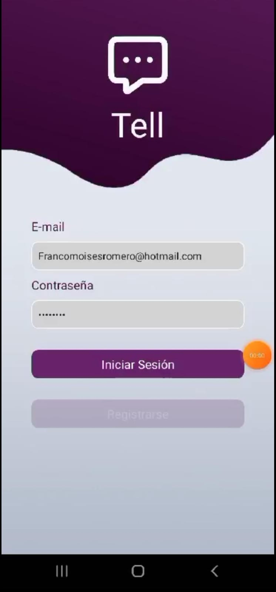
  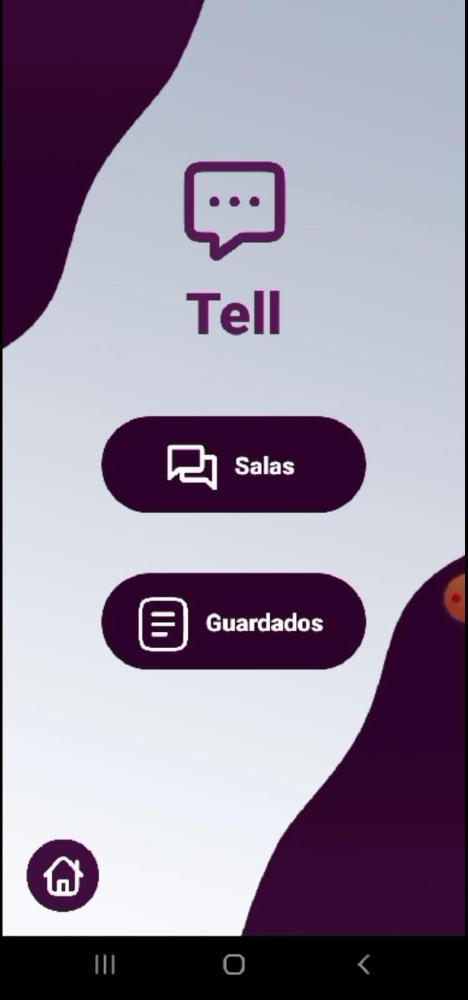
  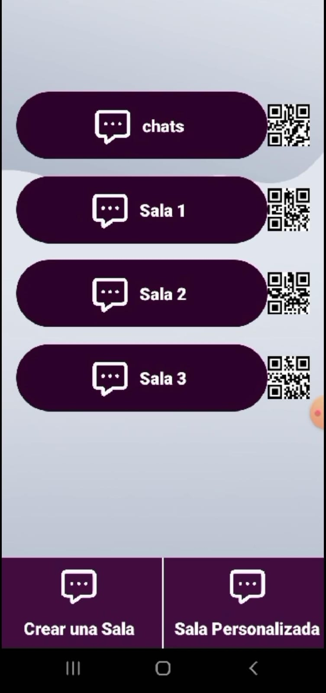
  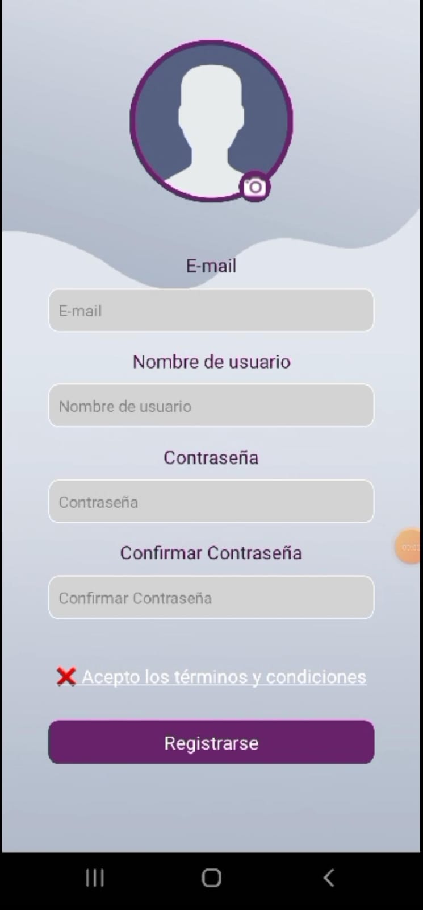
  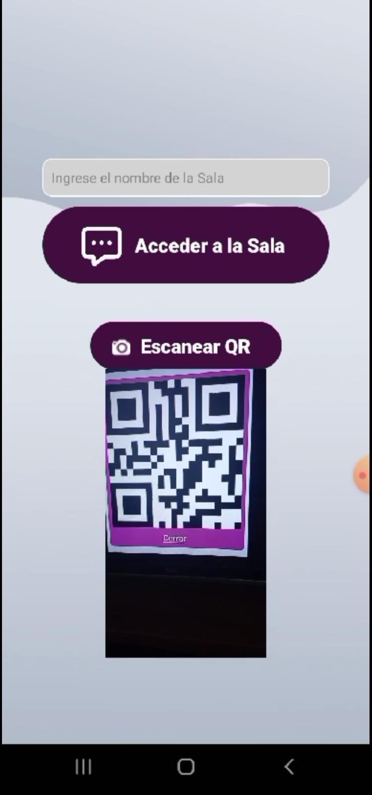
  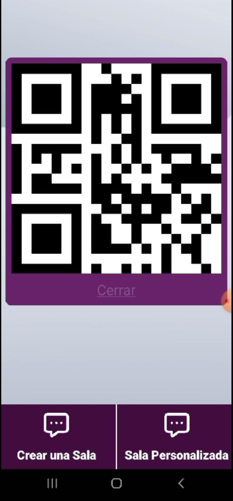
  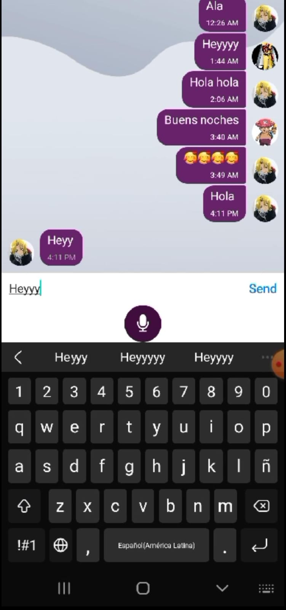
  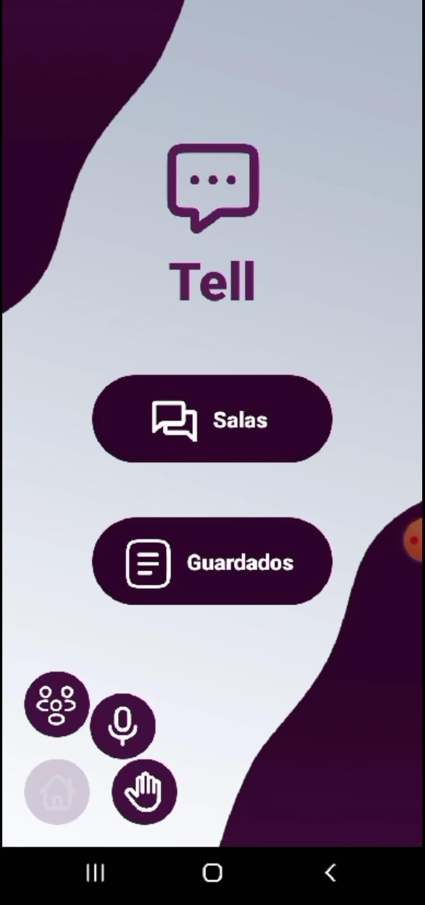
  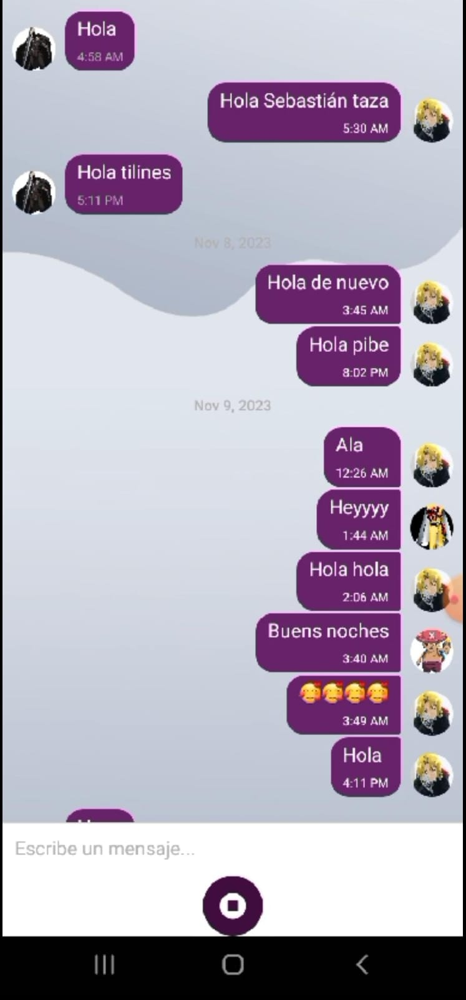
  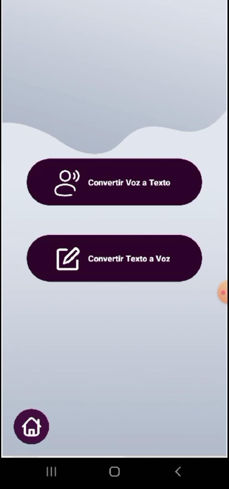
  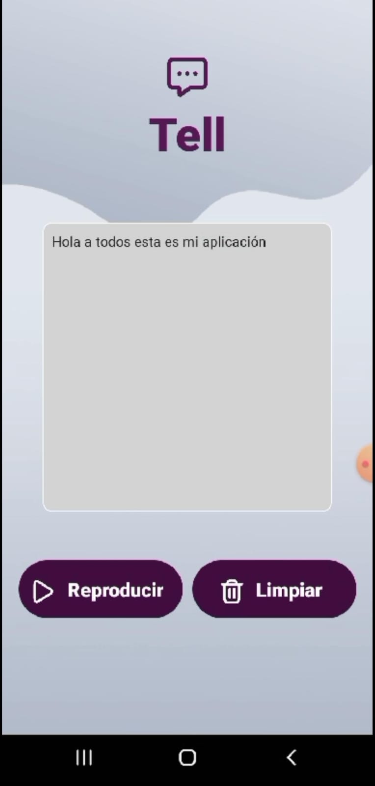
  
  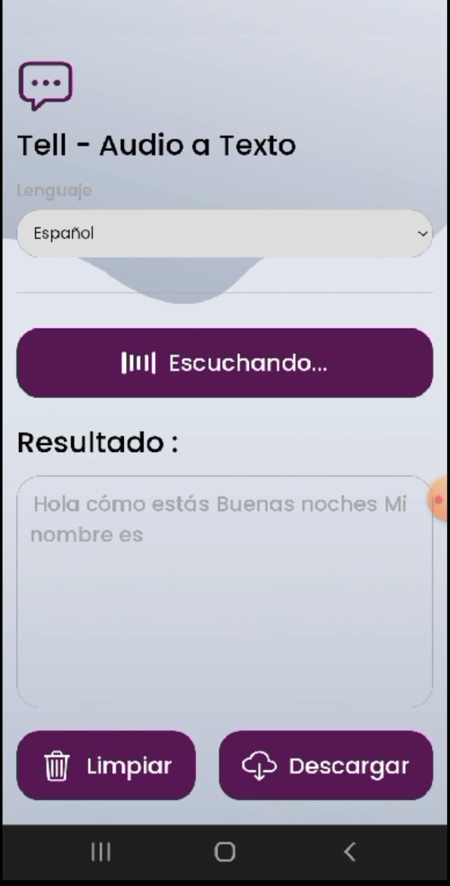
  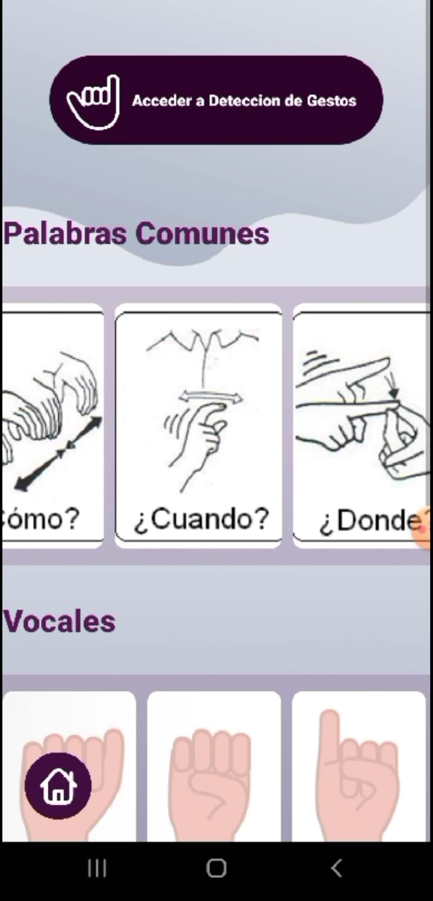
  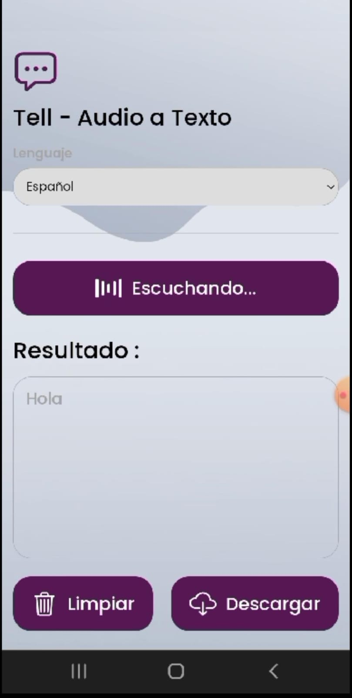
  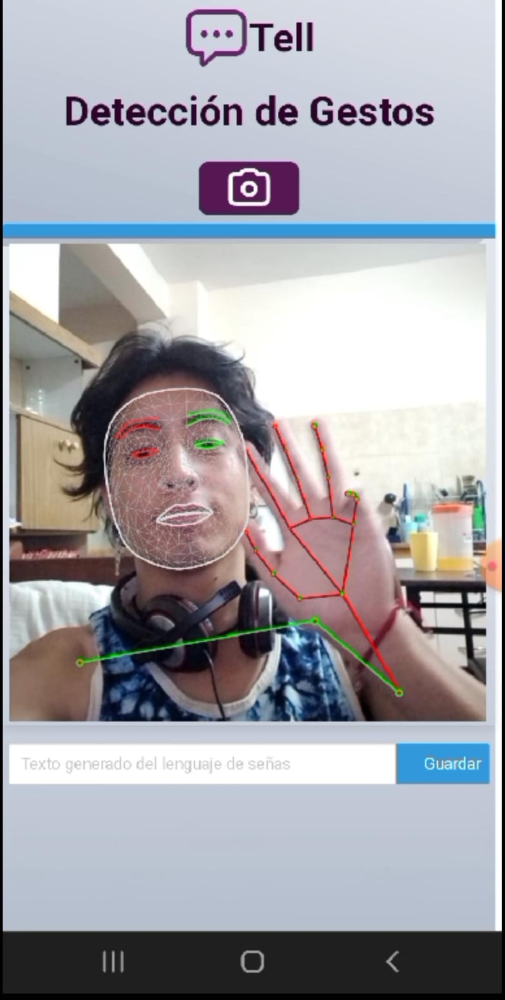
</div>


## 🏫 Créditos
- Desarrollador: Franco Julián Moisés Romero.

- Institución: Universidad Católica de Salta.
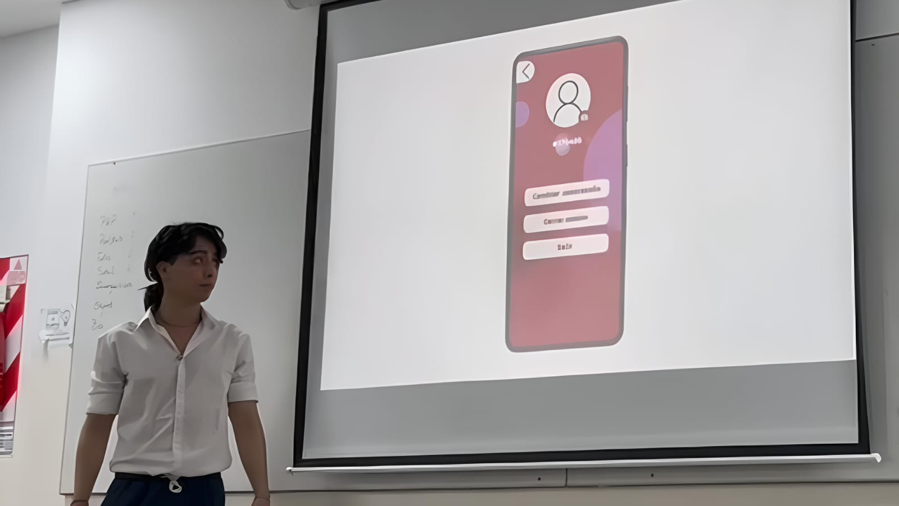
## 📬 Contacto
Para cualquier consulta o sugerencia, puedes escribirme a través de GitHub o enviarme un correo electrónico.

¡Gracias por apoyar este proyecto inclusivo! 💙
